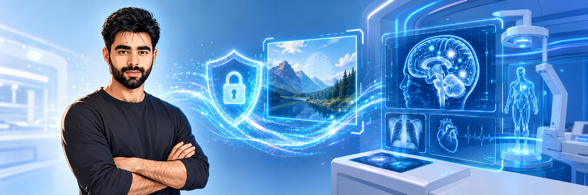

<!-- Banner -->

  

<h1 align="center">Hi 👋, I'm Syed Ahmed Hassan Shah</h1>
<h3 align="center">Machine Learning Engineer | AI Researcher | Robust Watermarking, Multimedia Forensics & Medical AI</h3>

  
  
  
  

  

---

## 🚀 About Me

I am a **Machine Learning Engineer and AI Researcher** currently focusing on **Robust Watermarking**, **AI Provenance**, **Multimedia Forensics**, and **Generative AI Security**. My current research focuses on building trustworthy visual AI systems by enabling AI-generated content to remain protected, verifiable, attributable, and traceable across complex transformations such as image editing, image-to-video generation, and real-world adversarial attacks.

Before moving deeply into the watermarking and provenance domain, I collaborated with researchers across several applied AI areas, including **Medical AI**, **Smart Transportation Systems**, **Geotechnical AI**, **Structural Health Monitoring**, **Point Cloud Intelligence**, **Digital Twins**, and **Electrochemical Biosensing-related AI applications**.

- 🔭 Currently focused on **Robust Watermarking, AI Provenance, Multimedia Forensics, and Generative AI Security**
- 🧠 Core areas: **Computer Vision, Deep Learning, Generative AI, Multimodal Learning, Foundation Models, and VLMs**
- 🤝 Previous research collaborations span **Medical AI, Smart Transportation, Structural Health Monitoring, and Geotechnical AI**
- 🏥 Medical AI: collaborated on AI-assisted diagnosis and medical image analysis for **Alzheimer’s disease, and clinical decision support**
- 🚆 Transportation AI: collaborated on **traffic injury severity prediction** and **highway edge-case robustness in autonomous driving**
- 🏗️ Infrastructure AI: collaborated on **railway inspection, point clouds, digital twins, and predictive maintenance**
- 🌍 Geotechnical AI: collaborated on **soil stability analysis using NMR data modeling and Physics-Infomred Neural Networks**
- 🧪 Biosensing: collaborated on **machine learning-assisted electrochemical simultaneous detection of dopamine and uric acid**
- 📘 Book author: co-author of the full book **Smart Infrastructure Management**, published by **Elsevier**, contributing across all **12 chapters**
- ✍️ Research profile: **20+ International Jounral publications**, **h-index: 12**, **i10-index: 12**
- 📫 Reach me at: **syedmahmedhassan321@gmail.com**

---

  ## 🎯 Research Focus

| Area | Focus |
|---|---|
| **Robust Watermarking and Multimedia Forensics** | AI provenance, content authenticity, traceability, attribution, image-to-video watermark robustness, temporal consistency, deepfake & tampering detection, generative robustness, and attack-aware evaluation |
| **Clinical AI and Medical imaging** | AI-assisted diagnosis and medical image analysis for Alzheimer’s disease, brain tumors, tuberculosis, breast cancer, segmentation, classification, domain translation, and clinical decision support |
| **Smart Transportation and Geotechnical AI** | Safety-focused transportation intelligence, autonomous-driving edge-case robustness, injury severity analysis, 3D infrastructure inspection, soil stability analysis, and infrastructure reliability |
| **Mathematical & Efficient AI Research** | Knowledge distillation, quantization, KV-cache optimization, lightweight inference, representation stability, theoretical bounds, robustness metrics, and evaluation frameworks for trustworthy AI systems |

## 🧩 GenAI & Deep Learning Stack

  
  
  
  
  
  
  
  

---

## 🛠️ Languages, Tools & Frameworks

  <!-- Languages -->
  

  <!-- ML / DL -->
  
  
  
  
  

  <!-- Backend / Data / Deployment -->
  
  
  

### Core Technical Skills

`Python` · `PyTorch` · `TensorFlow/Keras` · `OpenCV` · `Scikit-learn` · `NumPy` · `Pandas` · `Computer Vision` · `Deep Learning` · `Medical Imaging` · `NLP` · `Generative AI` · `RAG` · `Vision-Language Models` · `Diffusion Models` · `MLOps` · `IoT` · `Point Clouds` · `Digital Twins` · `AI Watermarking` · `Multimedia Forensics` · `Structural Health Monitoring` · `Geotechnical AI`

---

## 💼 Experience

| Role | Organization | Duration | Focus |
|---|---|---|---|
| **Research Assistant** | **Central South University, China** | Sep 2024 – Present | AI-driven railway infrastructure monitoring, intelligent infrastructure management, structural health monitoring, smart transportation systems, point cloud intelligence, generative AI, digital twins, and explainable maintenance systems |
| **AI Engineer** | **NeuroCare.AI, USA Remote** | May 2024 – Sep 2024 | Medical imaging, brain hemorrhage detection, computer vision, and AI-based diagnostic support |
| **AI Engineer / Research Assistant** | **National Center of Artificial Intelligence, Medical Imaging & Diagnostics Lab, Pakistan** | Sep 2022 – Sep 2023 | AI for MRI, CT, X-ray, ultrasound, tuberculosis, breast cancer, brain tumor diagnosis, and automated clinical decision support |

---

## 🎓 Education

| Degree | University | Duration | Details |
|---|---|---|---|
| **BS Computer Science** | **COMSATS University Islamabad, Pakistan** | 2018 – 2022 | CGPA: 3.24 / 4.00 |
| **Thesis** | **Transfer Learning-Based Contagious Diseases Transmission Video Surveillance: A COVID-19 Case Study** | 2022 | Developed an AI-powered video surveillance framework for monitoring contagious disease transmission. The work was presented at the **International Conference on Smart Systems and Emerging Technologies, ISSET**, and published as a book chapter in **Lecture Notes in Networks and Systems, LNNS Volume 1401, Springer** |

---

## 📌 What I Deliver

✅ **Trustworthy visual AI systems** — watermarking, provenance, traceability, attribution, multimedia security, and generative AI threat modeling  
✅ **End-to-end AI pipelines** — data preparation, model design, training, evaluation, deployment, and reproducible experimentation  
✅ **Medical AI pipelines** — preprocessing, segmentation, classification, clinical metrics, explainability, and diagnostic support  
✅ **Computer Vision solutions** — detection, segmentation, tracking, object localization, image enhancement, and visual inspection  
✅ **Smart infrastructure intelligence** — structural health monitoring, railway fastener inspection, infrastructure monitoring, health scoring, predictive maintenance, and digital twins  
✅ **Generative AI applications** — RAG, multimodal assistants, agents, VLMs, diffusion-based systems, and foundation model workflows  
✅ **Production-aware development** — clean code, experiment tracking, inference optimization, reproducibility, and deployment mindset  

---

## 🚀 Selected Projects

| Project | Description |
|---|---|
| **Railway Fastener AI Inspection System** | AI-driven railway fastener fault detection system with health scoring and Grad-CAM based explainable maintenance insights |
| **DiCOM Viewer for Medical Diagnosis** | AI-based diagnostic tool for chest, breast, and brain imaging under the Higher Education Commission, Pakistan |
| **Transfer Learning-Based COVID-19 Surveillance** | AI-powered video surveillance framework for detecting human interaction patterns related to contagious disease transmission |
| **Medical Image Analysis Systems** | AI models for tuberculosis, breast cancer, brain tumor, hemorrhage, Alzheimer’s disease, chronic wounds, and ulcers |
| **Point Cloud and Digital Twin Systems** | LiDAR-simulated multimodal intelligence for railway fasteners and smart infrastructure monitoring |
| **Geotechnical AI and Infrastructure Safety** | AI, PINNs, and generative modeling approaches for soil stability analysis and infrastructure reliability |

---

## 📚 Selected Publications

| No. | Year | Authorship | Publication / Work | Venue |
|---|---|---|---|---|
| **1** | **2025** | **1st Author** | Multimodal Cross-Domain Contrastive Learning: A Self-Supervised Generative and Geometric Framework for Visual Perception | Information Sciences |
| **2** | **2023** | **1st Author** | Classifying and Localizing Abnormalities in Brain MRI Using Channel Attention-Based Semi-Bayesian Ensemble Voting Mechanism and Convolutional Auto-Encoder | IEEE Access |
| **3** | **2024** | **1st Author** | Computer-aided Diagnosis of Alzheimer’s Disease and Neurocognitive Disorders with Multimodal Bi-Vision Transformer | Pattern Analysis and Applications |
| **4** | **2023** | **1st Author** | CADFU for Dermatologists: A Novel Chronic Wounds and Ulcers Diagnosis System with DHuNeT and YOLOv8 Algorithm | Healthcare |
| **5** | **2025** | **3rd-author** | LiDAR-Simulated Multimodal and Self-Supervised Contrastive Digital Twin Approach for Probabilistic Point Cloud Generation of Rail Fasteners | Journal of Computing in Civil Engineering |
| **6** | **2025** | **3rd-author** | Vector-Quantized Variational Teacher and Multimodal Collaborative Student for Crack Segmentation via Knowledge Distillation | Journal of Computing in Civil Engineering |
| **7** | **2025** | **3rd-author** | Multimodal Geometric AutoEncoder for Rail Fasteners Tightness Evaluation with Point Clouds and Monocular Depth Fusion | Measurement |
| **8** | **2026** | **2nd-author** | Multimodal Graph Neural Network Framework for Railway Fastener Tightness Assessment from High-Resolution Point Clouds | Engineering Applications of Artificial Intelligence |
| **9** | **2025** | **3rd-author** | Attention-Guided Triplet Framework for Synthetic Data Generation and Semantic Segmentation of Railway Fasteners under Data Scarcity and Disparity | Applied Soft Computing |
| **10** | **2025** | **3rd-author** | An Efficient PointNet-Based Multifaceted Autoencoder for Denoising Rail Track Fastener Point Clouds | Journal of Civil Structural Health Monitoring |
| **11** | **2025** | **3rd-author** | Self-Supervised Contrastive Anomaly Detection in Railway Fasteners Using Point Clouds and Deep Metric Learning for Imbalanced Dataset | Journal of Civil Structural Health Monitoring |
| **12** | **2025** | **3rd-author** | Intelligent Multitasking Framework for Boundary-Preserving Semantic Segmentation, Width Estimation, and Propagation Modeling of Concrete Cracks | Journal of Infrastructure Systems |

---

## 🏆 Awards, Training & Activities

| Year | Activity | Organization |
|---|---|---|
| **2024** | International Training on Clean Technologies for Pb and Zn Resource Utilization | Central South University |
| **2023** | Trainer: “Mastering Artificial Intelligence in 5 Days” | Medical Imaging and Diagnostics Lab |
| **2024–2025** | Marathon and Mountain Hiking Competitions | Central South University, China |

---

## 🎤 Conferences & Seminars

| Year | Event | Contribution |
|---|---|---|
| **2023** | AI Healthcare Summit, FAST-NUCES Islamabad | Presented AI research on breast cancer and brain tumor detection with the MIDL/NCAI team |
| **2022** | Breast Cancer Symposium, COMSATS University Islamabad | Organized industrial event representing NCAI and Medical Imaging & Diagnostics Lab |
| **2022** | International Conference on Smart Systems and Emerging Technologies, ISSET | Presented thesis-related work on transfer learning-based contagious disease transmission surveillance |

---

## 🌍 Languages

| Language | Proficiency |
|---|---|
| **English** | Professional working proficiency |
| **Chinese** | Intermediate communication level |

---

## 📈 GitHub Analytics

  
  

  

---

## 🤝 Connect with Me

  
  
  

