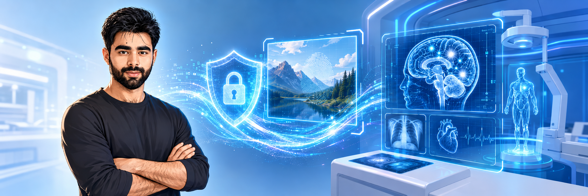

<!-- Banner -->

  

<h1 align="center">Hi 👋, I'm Syed Ahmed Hassan Shah</h1>

<h3 align="center">
AI Researcher | 3D Computer Vision | Intelligent Infrastructure | Scientific Machine Learning
</h3>

  
  
  
  
  

  

---

## 🚀 About Me

I am an **AI Researcher and MPhil researcher in Civil Engineering at Central South University, China**, with a previous degree in **Computer Science**.

My work lies at the intersection of **computer vision and engineering**, where I develop learning-based systems for railway inspection, structural condition assessment, 3D scene understanding, predictive monitoring, and physics-informed modeling.

My earlier research experience includes **Medical AI**, where I worked on deep-learning systems for brain imaging, tuberculosis screening, and breast-cancer analysis at the National Center of Artificial Intelligence, Pakistan, and NeuroCare.AI, USA.

I am particularly interested in building AI systems that move beyond isolated prediction toward reliable understanding of real-world physical systems.

- 🎓 MPhil Civil Engineering — Central South University
- 💻 BS Computer Science — COMSATS University Islamabad
- 📚 Published in Elsevier, Springer, IEEE, and ASCE venues
- 🏆 Best Researcher Award in Computer Vision, 2026
- 📫 **ahmed.hassan@csu.edu.cn**

---

## 🧩 Technical Stack

| Category | Tools & Methods |
|---|---|
| **Programming & ML** | Python, PyTorch, TensorFlow, Scikit-learn, NumPy, SciPy |
| **Computer Vision** | OpenCV, Ultralytics, Roboflow, image segmentation, object detection, self-supervised learning |
| **3D & Geometry** | Open3D, PyTorch Geometric, point clouds, monocular depth, geometric learning |
| **Scientific AI** | Physics-Informed Neural Networks, time-series modeling, uncertainty-aware learning |
| **Deployment** | ONNX, TensorRT, quantization, edge inference, model optimization |
| **Advanced AI** | Hugging Face, vision-language models, RAG, explainable AI |

---

<h2>💼 Experience</h2>

<table>
  <tr>
    <th align="left">Role</th>
    <th align="left">Organization</th>
    <th align="left">Duration</th>
    <th align="left">Contribution</th>
  </tr>

  <tr>
    <td><b>MPhil Researcher</b></td>
    <td><b>Central South University</b></td>
    <td><b>Sep 2024 – Present</b></td>
    <td align="justify">
      Developing AI-based methods for railway inspection, 3D structural analysis, engineering prediction, and deployable monitoring systems under challenging field conditions.
    </td>
  </tr>

  <tr>
    <td><b>Artificial Intelligence Engineer</b></td>
    <td><b>NeuroCare.AI</b></td>
    <td><b>May 2024 – Sep 2024</b></td>
    <td align="justify">
      Developed weakly supervised neuroimaging pipelines for brain-hemorrhage analysis using SAM-based segmentation, region-level supervision, and clinically oriented visual assessment.
    </td>
  </tr>

  <tr>
    <td><b>Artificial Intelligence Engineer</b></td>
    <td><b>National Center of Artificial Intelligence</b></td>
    <td><b>Sep 2022 – Sep 2023</b></td>
    <td align="justify">
      Contributed to government-funded medical AI projects across MRI, CT, X-ray, and ultrasound, including breast-cancer, tuberculosis, and brain-tumor applications.
    </td>
  </tr>
</table>

---

## 🚀 Selected Projects

| Project | Description |
|---|---|
| **🏗️ 3D Structural Change & Deformation Analyzer** | Point-cloud registration and geometric deviation analysis for quantifying structural changes between reference and inspected states. |
| **🚆 RailVision AI** | End-to-end railway fastener inspection system combining enhancement, detection, segmentation, condition classification, and maintenance-oriented visualization. |
| **🧮 GeoPINN Studio** | Physics-informed modeling platform for engineering prediction under limited experimental data. |
| **📡 VibraRAG AI** | Structural vibration analysis system combining signal processing, anomaly detection, condition comparison, and document-grounded engineering interpretation. |
| **⚙️ DeployBench AI** | Benchmarking framework for comparing model latency, model size, throughput, quantization, and deployment performance. |
| **🧬 Histopathology VLM Agent** | Vision-language system for histopathology image understanding and AI-assisted clinical reporting. |

---

## 📚 Selected Publications

| Year | Publication | Venue |
|---|---|---|
| **2026** | Multimodal Graph Neural Network Framework for Railway Fastener Tightness Assessment from High-Resolution Point Clouds | *Engineering Applications of Artificial Intelligence* |
| **2026** | AIoT-Based Rail Fastener Assessment in Low-Light Environment Using Focal Modulated Unsupervised Image Enhancement and Generative Segmentation | *Journal of Transportation Engineering, Part A: Systems* |
| **2026** | Unconfined Compressive Strength Prediction of Cement-Stabilized Aeolian Sand under Compaction-Induced Time Delay Effects Using Physics-Informed Neural Networks | *Transportation Geotechnics* |
| **2026** | Physics-Informed Neural Network--Integrated Point Cloud Decimation and 3D Mesh Modeling for Thermo-Mechanical Simulation of Rail Fasteners in Digital Twin Systems | *Journal of Civil Engineering and Management* |
| **2025** | Multimodal Cross-Domain Contrastive Learning: A Self-Supervised Generative and Geometric Framework for Visual Perception | *Information Sciences* |
| **2025** | Multimodal Geometric AutoEncoder for Rail Fastener Tightness Evaluation with Point Clouds and Monocular Depth Fusion | *Measurement* |
| **2025** | Intelligent Multitasking Framework for Boundary-Preserving Semantic Segmentation, Width Estimation, and Propagation Modeling of Concrete Cracks | *Journal of Infrastructure Systems* |
| **2023** | A Hybrid Neuro-Fuzzy Approach for Heterogeneous Patch Encoding in ViTs Using Contrastive Embeddings and Deep Knowledge Dispersion | *IEEE Access* |

  

---

## 📘 Academic Contribution

**Smart Infrastructure Management**, Elsevier, 2025

Contributed to research content across the book's 12 chapters covering sensing, intelligent infrastructure systems, predictive maintenance, computational methods, and engineering decision support.

---

<h2>🏆 Awards, Training & Academic Activities</h2>

<table>
  <tr>
    <th align="left">Year</th>
    <th align="left">Activity</th>
    <th align="left">Contribution</th>
  </tr>

  <tr>
    <td><b>2026</b></td>
    <td><b>Best Researcher Award in Computer Vision</b></td>
    <td>Recognized by Innovation Technologist for research contributions in computer vision and smart infrastructure applications.</td>
  </tr>

  <tr>
    <td><b>2024</b></td>
    <td><b>International Training on Clean Technologies for Pb and Zn Resource Utilization</b></td>
    <td>Completed a 12-day technical training program at Central South University.</td>
  </tr>

  <tr>
    <td><b>2023</b></td>
    <td><b>AI Workshop Instructor — COMSATS University / NCAI</b></td>
    <td>Designed and delivered a five-day hands-on training program in machine learning, deep learning, and computer vision.</td>
  </tr>

  <tr>
    <td><b>2023</b></td>
    <td><b>AI Healthcare Summit, FAST-NUCES Islamabad</b></td>
    <td>Presented research on breast-cancer imaging and brain-tumor analysis.</td>
  </tr>

  <tr>
    <td><b>2022</b></td>
    <td><b>International Conference on Smart Systems and Emerging Technologies</b></td>
    <td>Presented research on transfer-learning-based contagious-disease transmission video surveillance.</td>
  </tr>
</table>

---

<h2 align="center">📈 GitHub Analytics</h2>

  

  

  

  

---

<h3 align="center">
AI for understanding, monitoring, and improving real-world engineering systems.
</h3>
